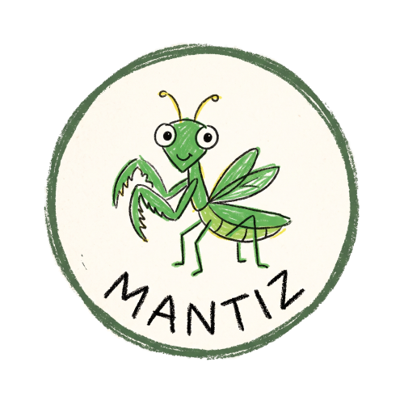
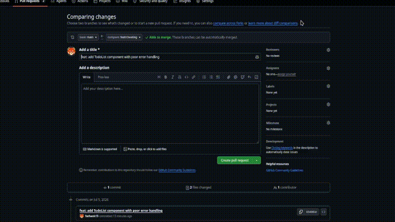
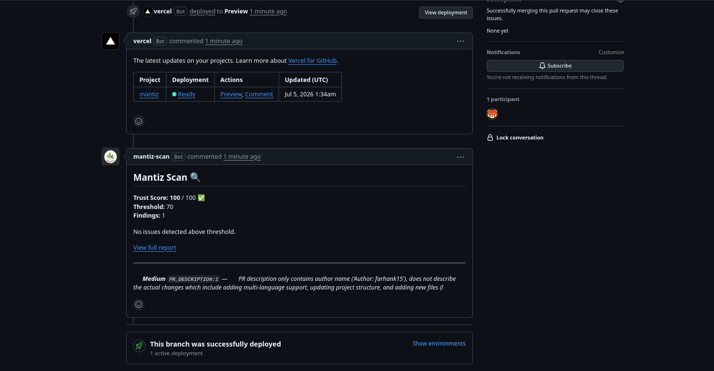
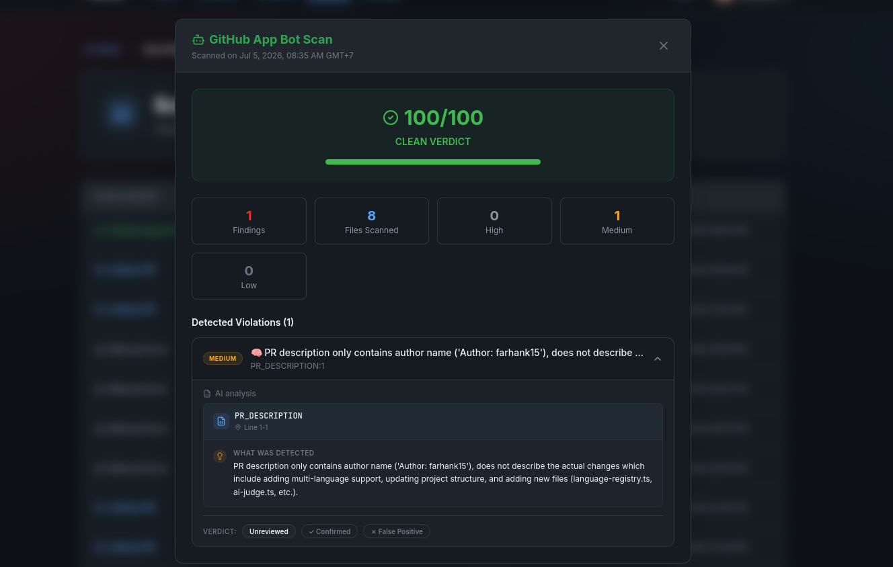
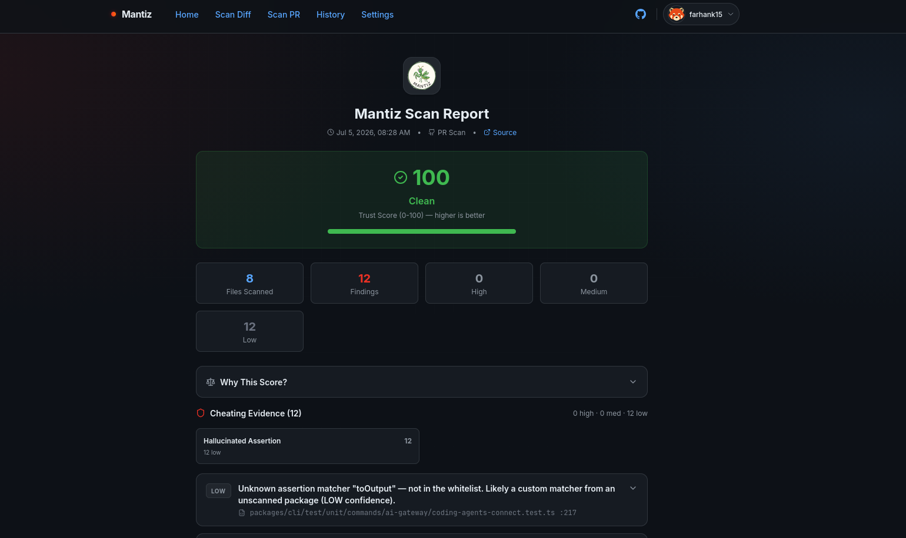
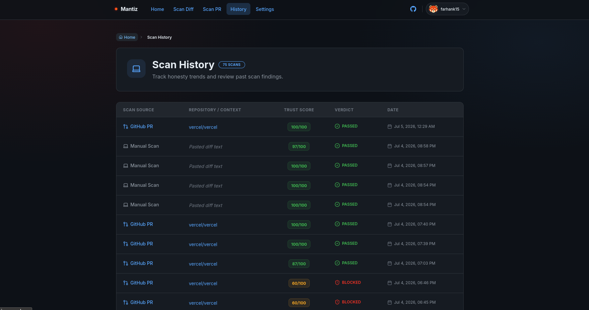

<p align="center">
  
</p>

<h3 align="center">Mantiz — AI Coding Agent Lie Detector</h3>

<p align="center">
  <em>Your agent cheats. Mantiz doesn't.</em><br />
  Scans diffs and PRs for patterns AI agents use to fake a passing test suite.
</p>

<p align="center">
  <a href="https://mantiz-wine.vercel.app"></a>
  <a href="LICENSE"></a>
  <a href="https://github.com/farhank15/mantiz/actions/workflows/ci-detectors.yml"></a>
  <a href="CHANGELOG.md"></a>
  <br />
  
  
  
  
  
</p>

---

## What is Mantiz?

Mantiz is an **AI-powered honesty detector for code** — built specifically to catch AI coding agents when they cheat on test suites. It scans every line of a diff through **11 detection patterns** and produces a **Trust Score (0–100)**.

AI agents often cheat subtly: skipping tests, disabling assertions, swallowing errors, or hallucinating matchers. Mantiz catches all of it — across **7 programming languages** — and posts results as GitHub PR comments, check runs, or dashboard reports.

> **Built for the [TestSprite S3 Hackathon](https://www.testsprite.com/hackathon-s3).** The loop: write → verify → fix. Mantiz is the verifier.

---

## Demo

<p align="center">
  
  <br />
  <em>PR Scan — Paste a GitHub PR URL and get instant detection results.</em>
</p>

<br />

<p align="center">
  
  <br />
  <em>GitHub App Bot — Auto-scans every PR and posts findings as inline comments + check run.</em>
</p>

<br />

<p align="center">
  
  <br />
  <em>Bot Report — Full scan breakdown with per-detector findings and trust score.</em>
</p>

<br />

<p align="center">
  
  <br />
  <em>Scan Report — Trust Score (0-100) with per-finding explanations.</em>
</p>

<br />

<p align="center">
  
  <br />
  <em>History — Every scan, manual or automated, saved and searchable.</em>
</p>

<br />

<p align="center">
  <video src="public/demo-mantiz.mp4" width="720" controls style="border-radius: 12px; border: 1px solid #30363d;">
    Your browser does not support the video tag.
  </video>
  <br />
  <em>Full Demo — See Mantiz in action: PR scan, dashboard, bot comments, and more.</em>
</p>

---

## Features

| | Feature | |
|---|---|---|
| 🤖 | **GitHub App Bot** — Auto-scan every PR. Inline comments + check runs + dashboard history for every scan | [Install Bot &rarr;](https://github.com/apps/mantiz-scan) |
| 🧠 | **RAG Codebase Context** — Qdrant vector DB indexes your repo. AI knows your APIs, no false positives | [Configure Qdrant](docs/qdrant.md) |
| 🌐 | **7 Languages** — JS/TS, Python, Go, Java, Ruby, Rust, PHP | [Multi-language docs](packages/mantiz-core/README.md) |
| 🩹 | **Self-Heal** — Auto-fix detected issues with AI-generated patches. One-click apply via PR suggestions | `--fix` flag |
| 🔬 | **11 Detection Patterns** — Static analysis + AI-assisted + historical behavioral | [Detector details](docs/BENCHMARK.md) |
| 🔗 | **CI/CD** — GitHub Action, CLI, API. Block builds on low trust scores | `uses: farhank15/mantiz@main` |
| 📊 | **Dashboard** — Scan history, per-user settings, API tokens, webhooks, share links | [mantiz-wine.vercel.app](https://mantiz-wine.vercel.app) |
| 🔐 | **GitHub OAuth** — Signed cookies, rate limiting, history persistence | |

---

## Quick Start

```bash
# Visit the live app
open https://mantiz-wine.vercel.app

# Or run locally
git clone https://github.com/farhank15/mantiz.git
cd mantiz
pnpm install
cp .env.example .env   # Add DATABASE_URL + GitHub OAuth keys
pnpm run dev
```

---

## How to Use

### 🤖 GitHub App Bot (Recommended)

The easiest way. Install the Mantiz GitHub App on your repos — every new PR gets scanned automatically with inline comments, check runs, and dashboard history.

```
Install → Open PR → Mantiz posts results as PR comments + check runs + saves to your history
```

**What happens when you open a PR:**
1. Mantiz receives the webhook
2. Scans the diff with all 11 detectors
3. Posts a trust score comment on the PR with per-finding breakdown
4. Sets a check run (pass if score ≥ threshold)
5. Saves the scan to your dashboard history (requires one-time login)

<p align="center">
  <a href="https://github.com/apps/mantiz-scan"></a>
</p>

<br />

### 🔗 GitHub Actions

For repos that can't use the App, or when you want CI gating:

```yaml
- name: Mantiz Scan
  uses: farhank15/mantiz@main
  with:
    api-token: ${{ secrets.MANTIZ_API_TOKEN }}
    threshold: 70
```

Generate a token from [Settings &rarr;](https://mantiz-wine.vercel.app/settings)

<br />

### 💻 CLI

```bash
# Local scan (no server needed)
npx mantiz-cli

# With AI + cloud persistence
npx mantiz-cli --token mtz_abc123 --ai --save --fix
```

<br />

### 🌐 Dashboard

| | Manual Scan | PR Scan |
|---|---|---|
| Where | [/scan](https://mantiz-wine.vercel.app/scan) | [/pr-scan](https://mantiz-wine.vercel.app/pr-scan) |
| Input | Paste raw diff | GitHub PR URL |
| Auth | None | GitHub OAuth |
| History | ✅ Saved | ✅ Saved |

---

## Multi-Language Detection

All 6 static detectors support **7 languages** via a shared language registry:

| Language | Disabled Assertion | Silent Catch | Mock Detection |
|:---------|:------------------:|:------------:|:--------------:|
| JS/TS | `.skip()`, `xit()` | `catch {}` | `vi.mock()` |
| Python | `@pytest.mark.skip` | `except: pass` | `@patch` |
| Go | `t.Skip()` | `if err != nil { return nil }` | `.On().Return()` |
| Java | `@Disabled` | `catch (E e) {}` | `Mockito.mock` |
| Ruby | `xit`, `pending` | `rescue; end` | `allow().to receive` |
| Rust | `#[ignore]` | — | — |
| PHP | `markTestSkipped()` | `catch (Exception $e) {}` | `createMock()` |

The heal engine can also auto-fix all of these patterns across every language.

---

## Configuration

### Environment Variables

| Variable | Required | Description |
|:---------|:--------:|:------------|
| `DATABASE_URL` | ✅ | Neon Postgres connection string |
| `GITHUB_CLIENT_ID` | ✅ | GitHub OAuth App client ID |
| `GITHUB_CLIENT_SECRET` | ✅ | GitHub OAuth App secret |
| `SESSION_SECRET` | ✅ | ≥32 chars, HMAC session signing |
| `FIREWORKS_API_KEY` | Optional | AI detection + embeddings (primary) |
| `GROQ_API_KEY` | Optional | AI detection fallback |
| `QDRANT_URL` | Optional | Qdrant Cloud cluster URL |
| `QDRANT_API_KEY` | Optional | Qdrant API key |
| `GITHUB_APP_ID` | Optional | GitHub App ID (auto-scan bot) |
| `GITHUB_APP_PRIVATE_KEY` | Optional | GitHub App private key PEM |
| `GITHUB_WEBHOOK_SECRET` | Optional | Webhook HMAC secret |

### Per-User Settings

Configured at [Settings](https://mantiz-wine.vercel.app/settings):

- **Threshold** (default 70) — minimum trust score
- **AI Detection** — enable LLM-powered analysis
- **Min Score** — hard floor for results
- **Webhook URL** — receive scan results as POST requests

---

## Benchmark

42 fixtures across 4 datasets. Live dashboard at [/benchmark](https://mantiz-wine.vercel.app/benchmark).

| Dataset | Fixtures | Type |
|:--------|:--------:|:-----|
| A — Honest Code | 4 | Real PRs (vitest-dev/vitest) |
| B — Lazy Cheating AI | 11 | Research-based (DebugML) |
| C — Smart Evasion AI | 4 | Research-based (DebugML) |
| FP — False Positives | 23 | 2 real + 21 documented |

See [BENCHMARK.md](docs/BENCHMARK.md) for full calibration data and per-detector precision/recall.

---

## Tech Stack

| Layer | |
|:------|---|
| **Framework** | [TanStack Start](https://tanstack.com/start) (React 19) |
| **Database** | [Neon Postgres](https://neon.tech) + [Drizzle ORM](https://orm.drizzle.team) |
| **Vector DB** | [Qdrant Cloud](https://qdrant.io) — HNSW + scalar quantization |
| **AI / LLM** | Fireworks AI (primary) + Groq (fallback) |
| **Embeddings** | `nomic-embed-text-v1.5` via Fireworks ($0.008/1M tokens) |
| **GitHub** | Octokit (App + OAuth) |
| **AST** | Tree-sitter WASM (8 languages) + Babel parser |
| **Styling** | Tailwind CSS v4 + Magic UI + Framer Motion |
| **Deploy** | [Vercel](https://vercel.com) |

---

## Project Structure

```
src/
├── detectors/       — 11 detection engines + heal engine + language registry
├── server/          — GitHub App, Qdrant indexing, auth, settings, webhooks
├── routes/          — TanStack file-based routes (7 pages + 3 API)
├── components/      — UI components + Magic UI animations
├── schemas/         — Drizzle ORM (11 tables)
└── lib/             — DB init, auth context, query client

packages/
├── mantiz-core/     — Standalone detection engine (npm)
└── mantiz-cli/      — CLI tool (npm)
```

---

## Community & Support

| | |
|---|---|
| 🐛 **Report bugs** | [GitHub Issues](https://github.com/farhank15/mantiz/issues) |
| 📖 **Changelog** | [CHANGELOG.md](CHANGELOG.md) |
| 🔒 **Security** | [SECURITY.md](SECURITY.md) |
| 📝 **Contributing** | [CONTRIBUTING.md](CONTRIBUTING.md) |
| 💬 **Discord** | [TestSprite Community](https://discord.gg/testsprite) |

---

<p align="center">
  <a href="https://mantiz-wine.vercel.app"></a>
  <a href="https://github.com/farhank15/mantiz"></a>
</p>
